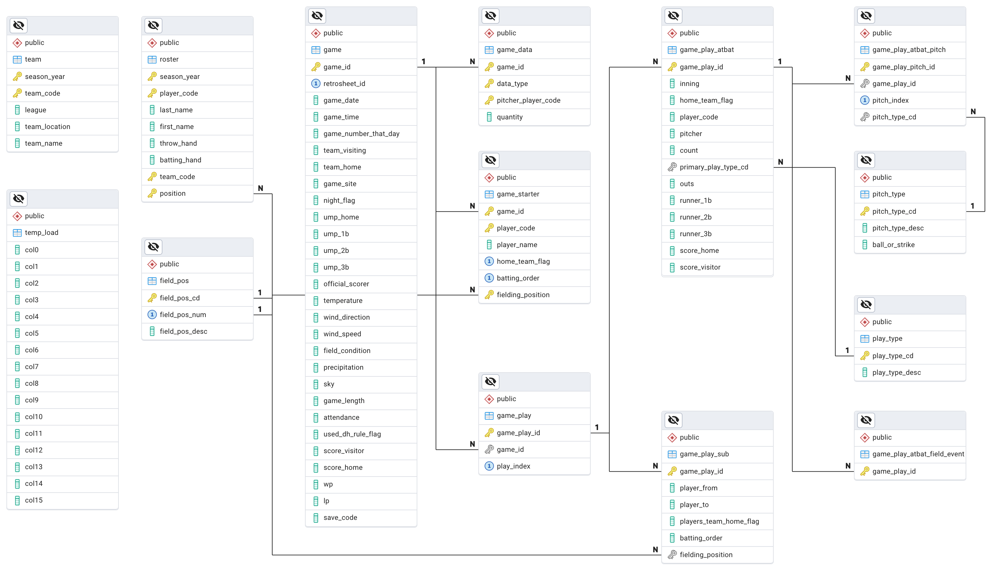

# Major League Baseball Database and Prediction Models

## Objective
This project seeks to provide a sandbox for the exploration of historical baseball game details and a framework for experimenting with and creating new predictive models for various game events.

## Data Ingestion Process
This process is choreographed using Make.
1. **Source datasets are downloaded:**
    - Retrosheet (https://www.retrosheet.org)
2. **Database Schema created**
    - data/sql (primarily create_tables.sql)
3. **Import Teams and Roster**
    - data/src/ingest (entry point is ingest_retrosheet_data.ipynb)
4. **Import Game Event Data**
    - This is a complicated, long running process that involves interpretting and replaying detailed game event files that contain Retrosheet event codes.
    - import-app/src (entry point is import_events_app.py)
5. *(Pending integration into training process)* **Hydrate Feature Store Repository**
    - data/feature_repo (Feast with Postgres as the online and offline source)
6. **Train the models**
    - data/src/train (one notebook per model)
    - Predict Pitch (train_predict_pitch_model.ipynb)
    - Predict Play (train_predict_play_model.ipynb)
7. **Deploy the models to VLLM (on OpenShift AI)**
    - TODO
8. **Setup K8S namespace for prediction service**
    - oc new-project baseball-prod
    - oc create secret generic kubeconfig-secret --from-file ~/.kube/config
9. **Deploy the prediction REST API**
    - predict-svc (source code)
    - deploy/Jenkinsfile (CI process)
    - deploy/baseball (Helm charts)
    - deploy/argo-app.yaml (Backstage catalog entry)
10. **Test the API**
    - deploy/Prediction API Test Plan.jmx (Stress test script using JMeter)

## Database ERD
This diagram was created using pgAdmin 4 (data/sql/erd.pgadmin4).

## Installation Instructions

### Prerequisities
1. This project was developed and tested on Mac.  Windows support is partial at this point.
2. Install Anaconda Distribution
3. Install PostgreSQL Server (localhost or shared server with 100G of free space)
4. Install PostgreSQL Client Tools

### Install on a Mac
1. Open a new terminal window
2. `conda create -n baseball`
3. `conda activate baseball`
4. `conda install python=3.11`
5. `make install`
6. Change config values and db host in Makefile
7. `make db` (warning - this is a destructive action as the database is recreated)
8. `make events`
    - If disk space is a limited resource, the log file is very verbose and can be disabled in the Makefile CLI arguments.
    - Once this process completes, feel free to backup the database for an expedited import process in the future.
9. (TODO - Hydrate Feature Store Repository)
10. `make train`
    - Each model will have its own subdirectory under target/models, where the ONNX model, scalers, and ROC chart can be found.
    - Predict Pitch (target/models/predict_pitch)
    - Predict Play (target/models/predict_play)

## Helpful Links

[Field Positions Reference](https://en.wikipedia.org/wiki/Baseball_positions)

[Play by Play Data File Formats](https://www.retrosheet.org/game.htm)
